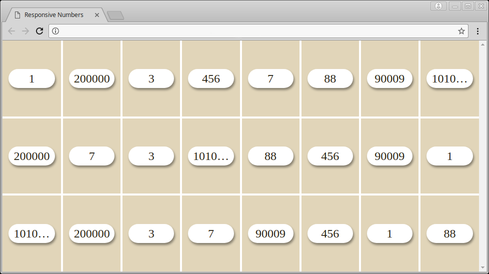

# Responsive Numbers

The aim of this exercise is to check your ability to make a responsive UI by only manipulating CSS and HTML

1. Open `index.html` and look how it is rendered by default
2. Try to render it like that, this is a full width and full height display, but try to not have to scroll

3. Bonus: to not crop too much numbers on small devices, try to add dedicated rules for devices with less than `width: 600px`

* Add your own rules in `styles.css`
* You can modify `index.html`, but we advise you to not change the `ul>li>span` structure on which some basis rules are applied
* The display should be same in IE11 or above, Firefox and Chrome for their latest version
* DO NOT modify `base.css` which contains the basis for this exercise
* Don't forget to submit what you've done, even if it's not working or not finished. That will be discussed during next interview.
---

We expect you to do your best, don't stress yourself, it's ok to skip some parts

**Good Luck!**
