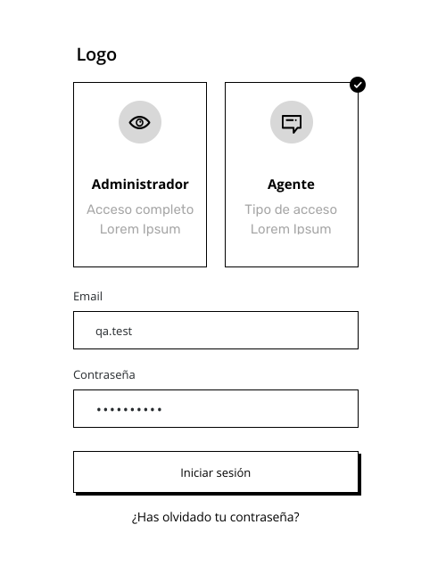

# Tested login page

The exercise is not considered completed if it does not have the following objectives achieved:

* Code coverage greater than or equal to 90%.
* The application must be compatible with IE11.
* (Bonus point) The use of a state manager will be considered.

The task includes the following aspects: `Documentation`, `Unit Testing`, `Layout` and `Componentization`.

## Description
The HR team of a company needs to create a portal for the registration of their employees, in order to comply with the new Decree to comply with the new Time and Attendance Law Decree.

In this sprint, the task: 107 creation of the login, for the execution of this task, it is necessary to create a login page. A login page needs to be created, it has to be componentized, attached:

